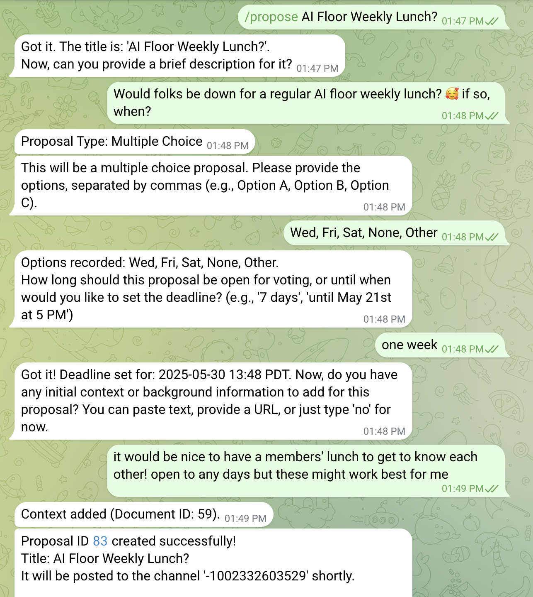
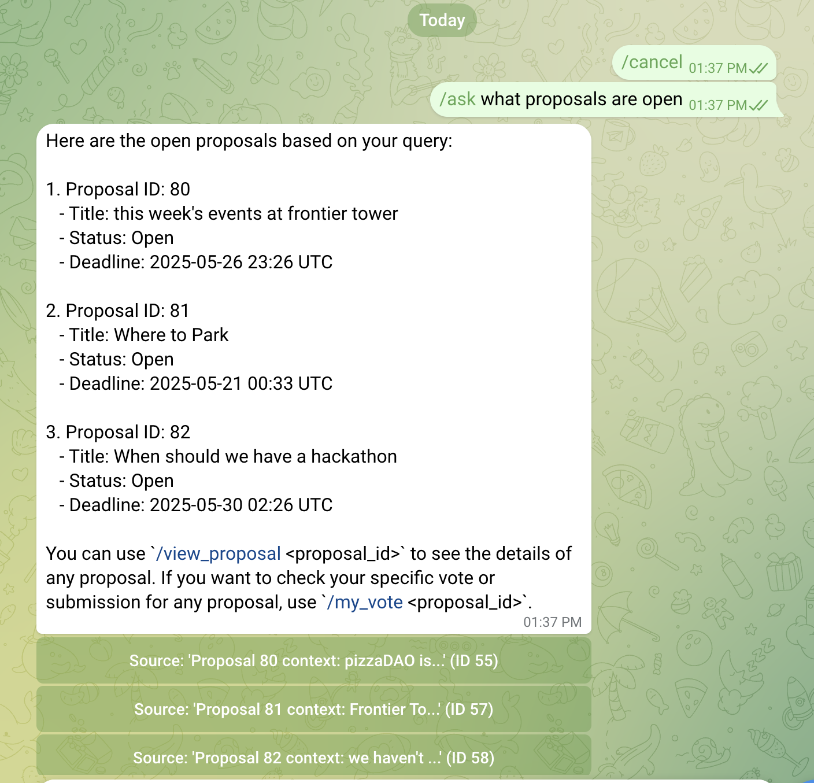

# CoordinationBot

A Telegram bot for proposals, voting, and knowledge base searching at Frontier Tower!

## Overview

proposal example | ask example
--- | ---
 | 

CoordinationBot helps members coordinate across their floors or the whole tower via:
- Ability to create proposals/polls/questionnaires with optional added context any user can query later
- Anonymous multiple-choice voting and free-form submissions
- Intelligent Information Retrieval through `/ask`:
    - **Semantic Search for Proposals:** Users can ask natural language questions like "what proposals closed last week?" or "which proposals are about funding?"
    - **Contextual Q&A (RAG):** Users can ask questions about general policies, specific proposal contexts, or anything in the knowledge base (e.g. "how does parking work at the tower?"). The bot searches through both global and proposal-specific docs.
- A conversational, natural-language interface for creating proposals, adding context, viewing results, question asking and more
- Automated deadline management and results announcement

Future features:
- users can upload or connect their own context to create a "digital twin" that introduces them to other members, projects, events, and surface relevant proposals
- personalized voting recommendations based on history and user preferences
- multi-modal context 🌟
- **I am very open to suggestions**, please make an issue or DM me at `@lishiyo` on Telegram! <3

**NOTE**: **This is still in progress!** Fleshing out [full list of commands](./memory-bank/bot_commands.md) and multi-channel support.

## Tech Stack

- `python-telegram-bot` - telegram library
- PostgreSQL - Supabase and SQLAlchemy
- ChromaDB for vector storage
- OpenAI API for natural language understanding and generation

## Key Features & Commands

CoordinationBot offers a range of features to streamline proposal management, voting, and information access. Here are some of the most important commands:

*   **Creating Proposals:**
    *   `/propose <Title>; <Description>; [Option1, Option2, ... OR "FREEFORM"]`: Initiates the creation of a new proposal. The bot will guide you conversationally to gather all necessary details like duration, target channel (if applicable), and initial context.

*   **Asking Questions & Getting Information:**
    *   `/ask <question>`: Your central hub for information.
        *   Ask about **proposals**: e.g., `/ask which proposals are about 'budget review' and are still open?`
        *   Ask about **general context/documents**: e.g., `/ask what are the guidelines for community events?`
        *   If you just type `/ask`, the bot provides guidance on how to ask effectively.
    *   `/help <question>`: Get intelligent help on how to use the bot. For example, `/help how do I see my votes?` will explain the relevant command.

*   **Managing Proposal Context:**
    *   `/add_doc <proposal_id>`: Allows a proposer to add supplementary context (text, URL, or via chat) to their specific proposal. This context is then used by the `/ask` command.
    *   `/add_global_doc <URL or paste text>` (Admin only): Allows administrators to add general context documents to the bot's global knowledge base.

*   **Viewing Proposals & Documents:**
    *   `/proposals open`: Lists all currently open proposals.
    *   `/proposals closed`: Lists all closed proposals and their outcomes.
    *   `/view_proposal <proposal_id>`: Shows a direct link to the proposal message in its channel.
    *   `/view_docs <proposal_id>`: Lists context documents attached to a specific proposal.
    *   `/view_doc <document_id>`: Displays the content of a specific document.

This is just a preview. For a comprehensive list of all commands and their detailed descriptions, please refer to [bot_commands.md](./memory-bank/bot_commands.md).

## Project Structure

Refer to [systemPatterns.md](`memory-bank/systemPatterns.md`) for a detailed architecture overview and directory structure.

## Setup & Installation

1.  **Clone the repository:**
    ```bash
    git clone <repository_url>
    cd telegram-voting-bot
    ```

2.  **Create and activate a Python virtual environment:**
    ```bash
    python3 -m venv venv
    source venv/bin/activate  # On macOS/Linux
    # venv\Scripts\activate    # On Windows
    ```

3.  **Install dependencies:**
    ```bash
    pip install -r requirements.txt
    ```

4.  **Set up environment variables:**
    *   Copy the `.env.example` file to `.env`:
        ```bash
        cp .env.example .env
        ```
    *   Edit the `.env` file and fill in your actual credentials and configuration values:
        *   `TELEGRAM_BOT_TOKEN`: Your Telegram Bot token from BotFather.
        *   `POSTGRES_USER`, `POSTGRES_PASSWORD`, `POSTGRES_HOST`, `POSTGRES_PORT`, `POSTGRES_DB`: Your Supabase (or other PostgreSQL) database connection details. Use the connection pooler details from Supabase for best results.
        *   `OPENAI_API_KEY`: Your OpenAI API key.
        *   `ADMIN_TELEGRAM_IDS`: Comma-separated list of Telegram user IDs for admin commands.
        *   `TARGET_CHANNEL_ID`: The default Telegram channel ID where proposals will be posted.

5.  **Set up the database schema:**
    *   Ensure your database is running and accessible with the credentials in your `.env` file.
    *   Apply Alembic migrations to create the necessary tables:
        ```bash
        alembic upgrade head
        ```

## Usage

**Running the Bot:**

1.  Ensure your virtual environment is activated and environment variables (`.env`) are set.
2.  Start the bot:
    ```bash
    python main.py
    ```
    You should see log messages indicating the bot has started polling for updates.

Refer to [bot_commands.md](./memory-bank/bot_commands.md) for a list of all commands.

## Development

See [testing_instructions.md](memory-bank/testing_instructions.md) for detailed instructions on how to test the bot for each command.

**Clearing Database Data (for testing/reset):**

A script is provided to clear all data from the `documents` and `proposals` tables (and `submissions` in the future) in your Supabase database. This is useful for starting with a clean slate during development or testing.

1.  Ensure your virtual environment is activated.
2.  Run the script using one of the following commands from the project root directory (`telegram-voting-bot`):
    ```bash
    # Option 1: Run as a module (recommended)
    python -m app.scripts.clear_supabase_data

    # Option 2: Run directly
    python app/scripts/clear_supabase_data.py
    ```
3.  The script will ask for confirmation before deleting any data. Type `yes` to proceed.

    **WARNING:** This operation is irreversible and will delete all data in the specified tables.
    
     